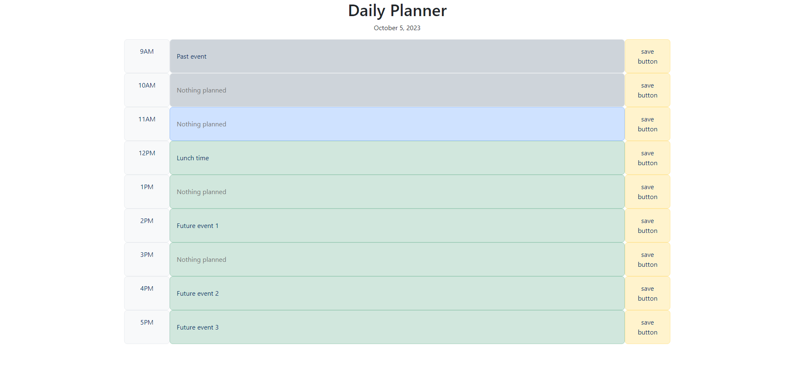

# Daily Planner

## Description

I designed this project to help me learn jQuery, Bootstrap and Dayjs. This project is small and simple in terms of code, but it still touches on each of these libraries to help me get a grasp on using libraries in general while getting some basic practice in for each of the ones listed above. The purpose of the project is to list the 9-5 hours of the day while displaying the date at the top of the page. Each of these hour blocks can be edited to hold some sort of text and can be saved via a save button on the right side of the screen. These entries are each saved to local storage and persist after a page reload. The current hour is also reflected through color coordination of hour blocks. All past hours are displayed in gray, all future hours are displayed in green and the current hour is displayed in blue. 

Link to the deployed project: